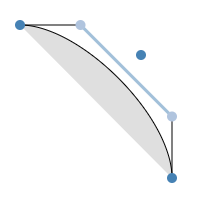
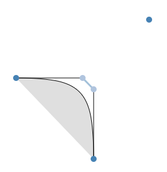
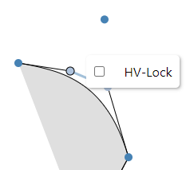
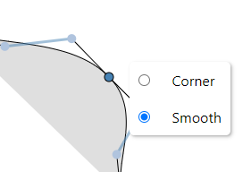

# Tunni Lines Reverse Engineered

### Credits:
_The Tunni lines concept was devised by Eduardo Tunni and Fontlab Ltd., and is used in the FontLab
font editor._

Many thanks go to Adam Twardoch and the people at FontLab who kindly gave permission to publish this
repository.

### Interactive Demo

https://oliverleenders.github.io/Tunni-Lines/

## Motivation

I have been amazed by the ingenuity and ease of use of FontLab's _Tunni Line_ feature. Using either
a single control point or dragging a line, the user is allowed to symmetrically and asymetrically
change the shape of a cubic bezier curve. While the start and endpoints stay the same and the
direction of the control handles remains fixed, the handles are linearly scaled in order to modify
the curve.

Using the visualizations on the FontLab website, I have reverse engineered the math behind the
feature and implemented a simple example using `D3.js` (probably overkill for such a simple thing
but hey).

## Math

### Tunni Point

Given a starting point $(a_x, a_y)$, control points $(c_x^{(1)}, c_y^{(1)})$,
$(c_x^{(2)}, c_y^{(2)})$ and an endpoint $(b_x, b_y)$, as well as the intersection point of the
control handles $(s_x, s_y)$ the position of the Tunni Control point $(t_x, t_y)$ is defined as
follows:

$$t = 2 c^{(1)} + 2 c^{(2)} - b - s$$

$$t_x = 2 \cdot c_x^{(1)} - a_x + 2 \cdot c_x^{(2)} - b_x - s_x$$

$$t_y = 2 \cdot c_y^{(1)} - a_y + 2 \cdot c_y^{(2)} - b_y - s_y$$

### Tunni Line

The Tunni Line however is simply a line between the points $c^{(1)}$ and $c^{(2)}$.

### Update of the Handles Given Tunni Point and Handle Direction

Given the position of the tunni point $t$, as well as the start point $a$, control points
$c^{(1)}$, $c^{(2)}$ and the endpoint $b$, we can update the position of the control points as
follows:

1. Find the halfway point $h(a)$ between $t$ and $a$, or respectively $h(b)$ with $t$ and $b$.
    $$h_x(a) = \frac{a_x + t_x}{2}, \qquad h_y(a) = \frac{a_y + t_y}{2}$$

    $$h_x(b) = \frac{b_x + t_x}{2}, \qquad h_y(b) = \frac{b_y + t_y}{2}$$

3. Add to $h(a)$ (or $h(b)$) the vector of the second (or first) control point $c^{(2)}$ (or
    $c^{(1)}$).
    $$h_x'(a) = h_x(a) + c_x^{(2)} - b_x, \qquad h_y'(a) = h_y(a) + c_y^{(2)} - b_y$$

    $$h_x'(b) = h_x(b) + c_x^{(1)} - a_x, \qquad h_y'(b) = h_y(b) + c_y^{(1)} - a_y$$

5. Compute the intersection between the line $\overline{h(a)h'(a)}$ and the line $\overline{ac^{(1)}}$
    ($\overline{h(b)h'(b)}$ and $\overline{bc^{(2)}}$ respectively) and use the resulting points as new coordinates for $c^{(1)}$ (or $c^{(2)}$).

### Update of the Handles Given Tunni Line and Handle Direction

Let $\ell$ be some point on the Tunni Line. Note: When the tunni line is moved, its direction does
not change. Therefore, we can intersect the line $\overline{\ell(\ell + c^{(1)} - c^{(2)})}$ with 
the lines $\overline{ac^{(1)}}$ and $\overline{bc^{(2)}}$ to get our new handles.

### Balance Handles

In FontLab, it is possible to double click the Tunni Point to balance out the bezier curve. This can
be achieved as follows:

1. Compute the scale factors for both the control handles:
    $$\lambda^{(1)} = \frac{||\overline{ca}||_2}{||\overline{sa}||_2} = \frac{\sqrt{\left(c_x^{(1)} - a_x\right)^2 + \left(c_y^{(1)} - a_y\right)^2}}{\sqrt{\left(s_x - a_x\right)^2 + \left(s_y - a_y\right)^2}}$$
    $$\lambda^{(2)} = \frac{||\overline{cb}||_2}{||\overline{sb}||_2} = \frac{\sqrt{\left(c_x^{(2)} - b_x\right)^2 + \left(c_y^{(2)} - b_y\right)^2}}{\sqrt{\left(s_x - b_x\right)^2 + \left(s_y - b_y\right)^2}}$$
2. Take the average of both scale factors.
    $$\lambda^* = \frac{\lambda^{(1)} + \lambda^{(2)}}{2}$$
3. Rescale the handles using $\lambda^{\ast}$.
    $$c_x^{(1)} = a_x + \lambda^* \cdot \left(s_x - a_x\right) \qquad c_y^{(1)} = a_y + \lambda^* \cdot \left(s_y - a_y\right)$$
    $$c_x^{(2)} = b_x + \lambda^* \cdot \left(s_x - b_x\right) \qquad c_y^{(2)} = b_y + \lambda^* \cdot \left(s_y - b_y\right)$$

This "balance"-operation is different from other balancing operations beause it does not necessarily
ensure a smooth curve (especially at the joints of two incident bezier curves) but just states that
the tunni Line should be parralel to the line $\overline{ab}$.

## Constraints

### When is the Tunni Point Useful

For the Tunni Point to be "well" defined, both handles must lie on the same side of the line
$\overline{ab}$. Furthermore, the intersection point of $\overline{ac^{(1)}}$ and
$\overline{bc^{(2)}}$ should also lie on this side of $\overline{ab}$, i.e., the handles should
point towards one another, not away from each other (behaviour of the Tunni Point is weird when this
is not the case).

### When is the Tunni Line Useful

The Tunni Line can remain visible at all times – well, almost. When both control points lie on the
line $\overline{ab}$, dragging the tunni line (which always moves orthogonal to its direction) is
not defined as the handles are not allowed to change direction leading to the control points no
longer existing.

### Moving the Tunni Line

Additional checks are required when moving the tunni line such that no control points passes through
its corresponding anchor during scaling. When this happens, the dragging should end immediately.
